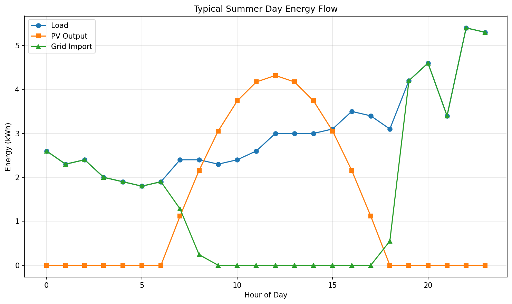
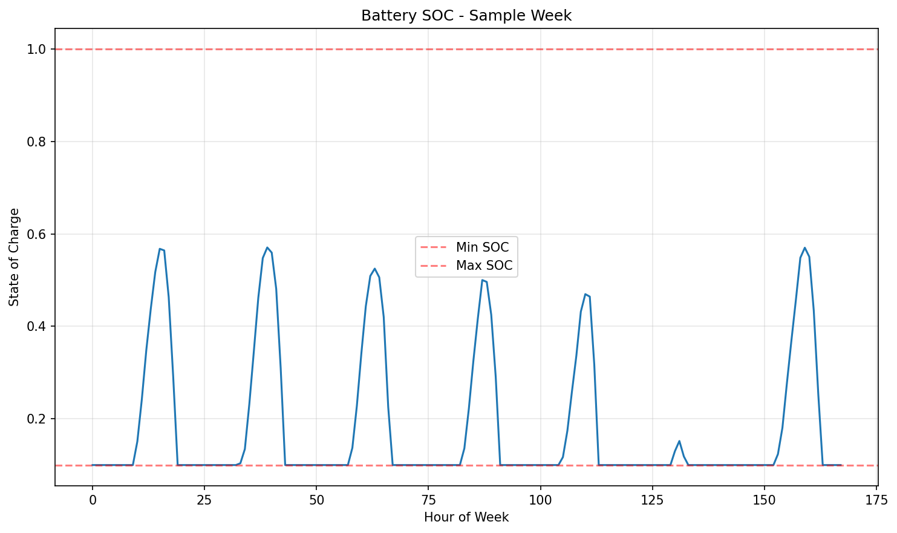
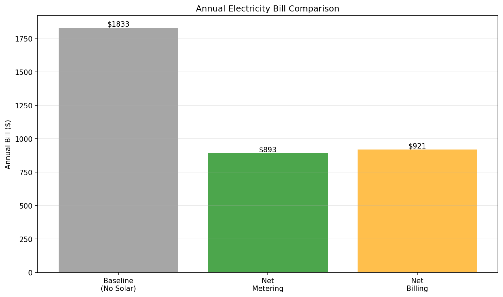
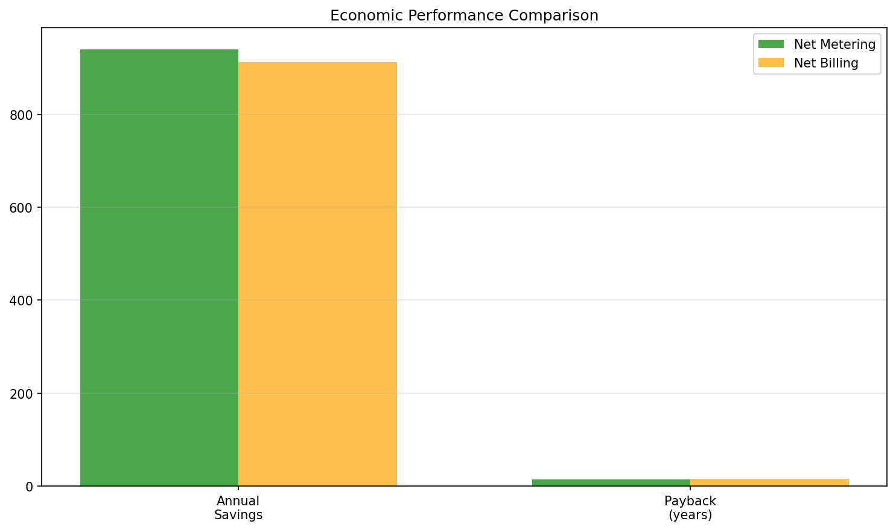

# Photovoltaic Solar-Cell Simulator

> Coursework project. Area: energy, software.

## Overview
This repository contains my project deliverables (pulled from my own project files).

## Tools & Tech
- PDF report
- Python
- report (Word)

## Repository Structure
```
.gitignore
LICENSE
README.md
data/703080TYA.CSV
data/703160TYA.CSV
data/724699TYA.CSV
data/725970TYA.CSV
data/726810TYA.CSV
data/726930TYA.CSV
data/727815TYA.CSV
data/727928TYA.CSV
data/727970TYA.CSV
data/README.md
data/load_data.csv
data/pv_profile.csv
data/sensitivity_results.csv
docs/EEE 465_591 – Solar Cell Mini Project #2 (Saif Elsaady).pdf
docs/EEE591_MiniProject1_Elsaady.html
docs/EEE591_Project_Paper.docx
docs/Elsaady_EEE591_Project1.docx
docs/PracticeProblem1_Elsaady_EEE591.html
docs/solar_project_report.html
images/plot1_energy_flow.png
images/plot2_battery_soc.png
images/plot3_annual_bills.png
images/plot4_economics.png
images/plot5_sensitivity.png
images/pv_battery_analysis_results.png
src/Code snip for arrays for day number hour of the day and month.py
src/Code snip for electricity rate and cost calculations.py
src/Code snip for financial functions with example.py
src/Code snip for financial functions.py
src/EEE591_MiniProject1_Elsaady.py
src/Elsaady_FinalProject_EEE591.py
src/Elsaadycell_simulator_F24.py
src/Solar Data Position F 2024.py
src/code snip for calculating elevation and azimuth.py
```

## Code
Source is in `src/`. Provided as submitted; not independently re-run here.

## Results
See `docs/EEE 465_591 – Solar Cell Mini Project #2 (Saif Elsaady).pdf`.

## Preview





## License
MIT — see `LICENSE`.

---
_Part of my engineering coursework portfolio. Deliverables only._