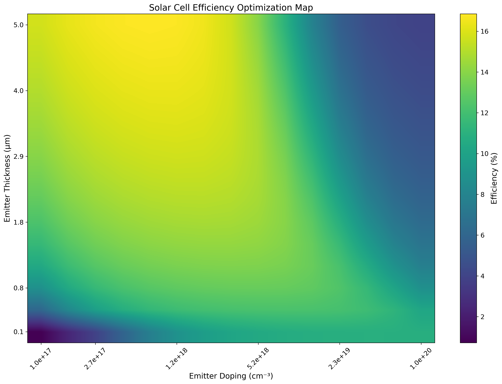
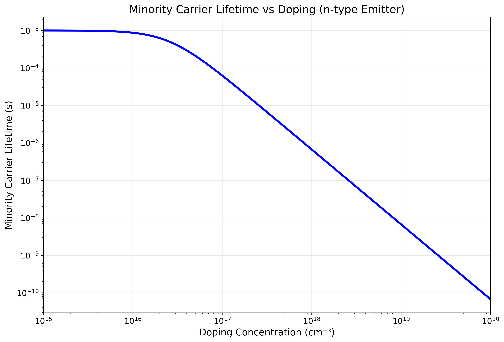
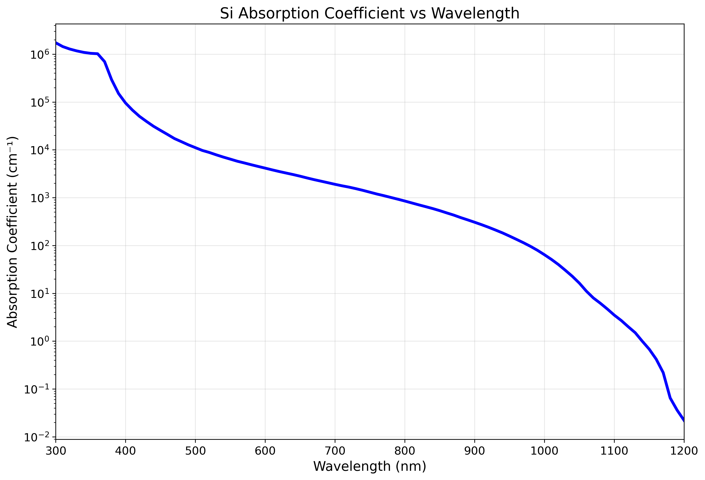
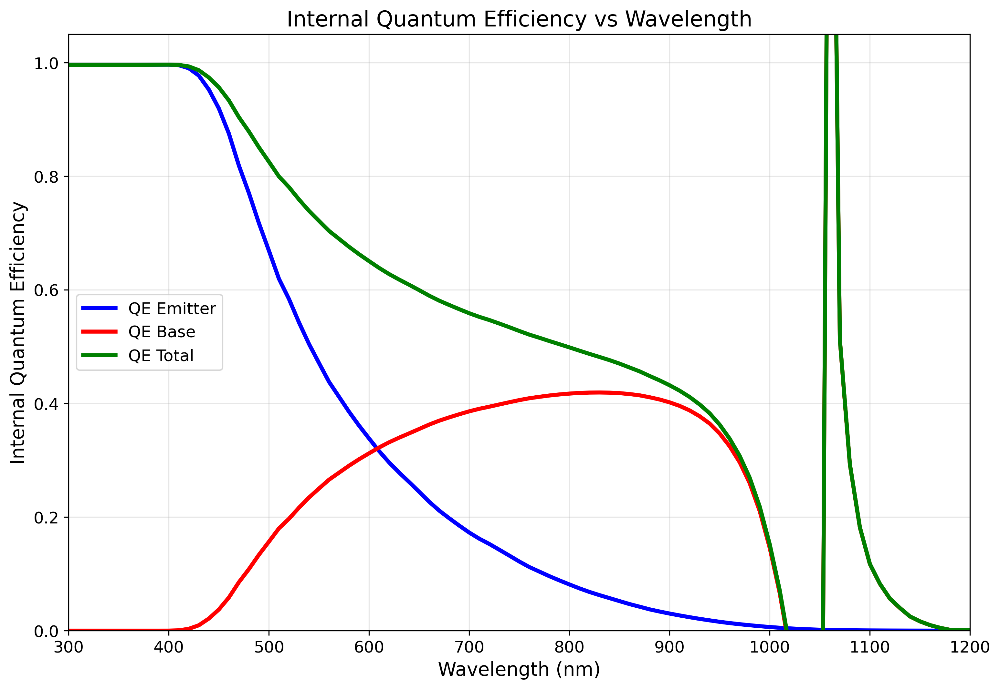
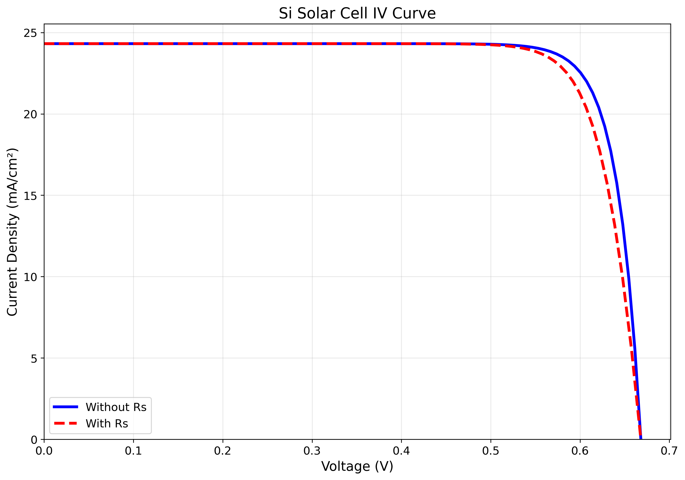

# Solar-Cell Simulator

> Python photovoltaic toolkit: silicon cell device physics plus PV-battery techno-economics.

    



### 🌐 Live project page → **https://selsaady1.github.io/eee591-photovoltaic-solar-cell-simulator/**

## Overview
A coursework project (ASU EEE 465/591, Photovoltaic Energy Conversion) bundling two Python photovoltaic studies. The first is a first-principles silicon solar-cell simulator that computes absorption, quantum efficiency, dark/light currents, series resistance, and the IV curve, then sweeps emitter design to maximize efficiency. The second is an 8,760-hour techno-economic simulation of a residential 5 kW PV plus 14 kWh battery system, comparing net metering against net billing under Salt River Project time-of-use rates.

**Highlight:** 13.28% cell efficiency

**Highlight:** 13.28% cell efficiency

## Key Achievements
- Built a silicon solar-cell device simulator computing alpha(lambda), internal quantum efficiency, dark saturation current J0 (split emitter/base), light-generated current JL, and series resistance, extracting Jsc 24.3 mA/cm2, Voc 0.668 V, FF 0.817, and efficiency ~13.28% under 1-sun
- Validated outputs against reference (Appendix A) values, matching sheet resistivity and series resistance to within rounding and J0 to within a few percent
- Ran an exhaustive grid search over emitter doping (Ne) and thickness (We) to maximize cell efficiency, balancing Auger-limited lifetime, sheet resistance, and recombination
- Simulated a 5 kW PV + 14 kWh battery home over 8,760 hours with SRP time-of-use rates, modeling battery dispatch (10-100% SOC) and computing annual bills, NPV, LCOE, and payback
- Quantified net metering vs net billing: $892.78 vs $920.72 annual cost, 15.1 vs 15.6-year payback, NPV of -$7,572 vs -$8,059, identical LCOE of $0.0956/kWh, with a battery-cost sensitivity sweep ($225/$300/$375 per kWh)

## Approach
Both simulators are written in Python using NumPy, pandas, and Matplotlib. The cell simulator implements solar-cell device equations (Auger lifetime model, diffusion lengths, IQE integration, busbar-limited series resistance, diode IV) and integrates measured AM1.5G/absorption tables on a 10-nm grid. The techno-economic model ingests hourly load and PV CSV profiles (8,760 rows), applies a three-season TOU rate structure and battery dispatch logic, and uses standard financial functions (NPV discounting, capital recovery, geometric-series O&M growth, scheduled battery replacements) over a 25-year, 3%-discount horizon.

## Tools & Technologies
- Python
- NumPy
- pandas
- Matplotlib

## Gallery





## Repository Structure
```
.gitignore
.nojekyll
LICENSE
README.md
data/703080TYA.CSV
data/703160TYA.CSV
data/724699TYA.CSV
data/725970TYA.CSV
data/726810TYA.CSV
data/726930TYA.CSV
data/727815TYA.CSV
data/727928TYA.CSV
data/727970TYA.CSV
data/README.md
data/load_data.csv
data/pv_profile.csv
data/sensitivity_results.csv
docs/EEE 465_591 – Solar Cell Mini Project #2 (Saif Elsaady).pdf
docs/EEE591_MiniProject1_Elsaady.html
docs/EEE591_Project_Paper.docx
docs/Elsaady_EEE591_Project1.docx
docs/PracticeProblem1_Elsaady_EEE591.html
docs/solar_project_report.html
images/fig1.png
images/fig2.png
images/fig3.png
images/fig4.png
images/fig5.png
images/fig6.png
images/plot1_energy_flow.png
images/plot2_battery_soc.png
images/plot3_annual_bills.png
images/plot4_economics.png
images/plot5_sensitivity.png
images/pv_battery_analysis_results.png
index.html
src/Code snip for arrays for day number hour of the day and month.py
src/Code snip for electricity rate and cost calculations.py
src/Code snip for financial functions with example.py
src/Code snip for financial functions.py
src/EEE591_MiniProject1_Elsaady.py
src/Elsaady_FinalProject_EEE591.py
src/Elsaadycell_simulator_F24.py
src/Solar Data Position F 2024.py
src/code snip for calculating elevation and azimuth.py
```

## Results
The cell simulator reports Jsc 24.3 mA/cm2, Voc 0.668 V, FF 0.817, and ~13.28% efficiency, with figures-of-merit matched against Appendix A references. The techno-economic study finds both billing policies cut the $1,832.55 baseline bill by roughly 50% yet yield negative 25-year NPVs (-$7,572 net metering, -$8,059 net billing) and 15+ year paybacks under current Arizona rates. Full details are in docs/EEE591_Project_Paper.docx and docs/EEE 465_591 - Solar Cell Mini Project #2 (Saif Elsaady).pdf.

## Deliverable
See [`docs/EEE591_Project_Paper.docx`](docs/EEE591_Project_Paper.docx).

## License
MIT — see [`LICENSE`](LICENSE).

---
_Part of [Saif Elsaady's engineering portfolio](https://selsaady1.github.io/portfolio/). Deliverables only — routine homework/quizzes/exams excluded._